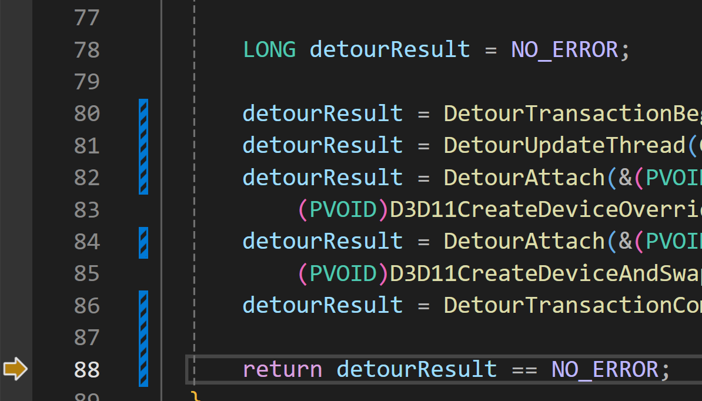

# Readme

This document is only for developers who wants to mess the FFMpeg extension.

Fusion doesn't provide direct access to D3D functions, which make it very hard to debug when you trying to involve D3D stuffs, as debug layer can only be enabled when initializing D3D.

The good news is, fusion won't init D3D until all extension dlls are loaded, so we can do some tricks to enable debug layer before D3D is initialized, by hooking D3D init functions in `Initialize` (from `General.cpp`, called when dll be loaded).

to achieve this, we need [detours](https://github.com/microsoft/Detours), which requires [NMAKE](https://learn.microsoft.com/en-us/cpp/build/reference/nmake-reference?view=msvc-170) and follows the [document](https://github.com/microsoft/detours/wiki/faq#where-can-i-find-detourslib-and-detoursh) to build.

As fusion is 32bit for now, we should use [x86 Native Tools Command Prompt](https://learn.microsoft.com/en-us/cpp/build/building-on-the-command-line?view=msvc-170#developer_command_prompt_shortcuts) or x64_x86 Cross Tools Command Prompt. For future 64bit version we should use x64 tool sets respectively.

we doesn't need samples so only build files in src folder.

```bat
cd /d "Path-To-Detours/src"
nmake
```

now we should get `lib.X86` folder and `include` folder in `Path-To-Detours`, and can build then debug the extension.


