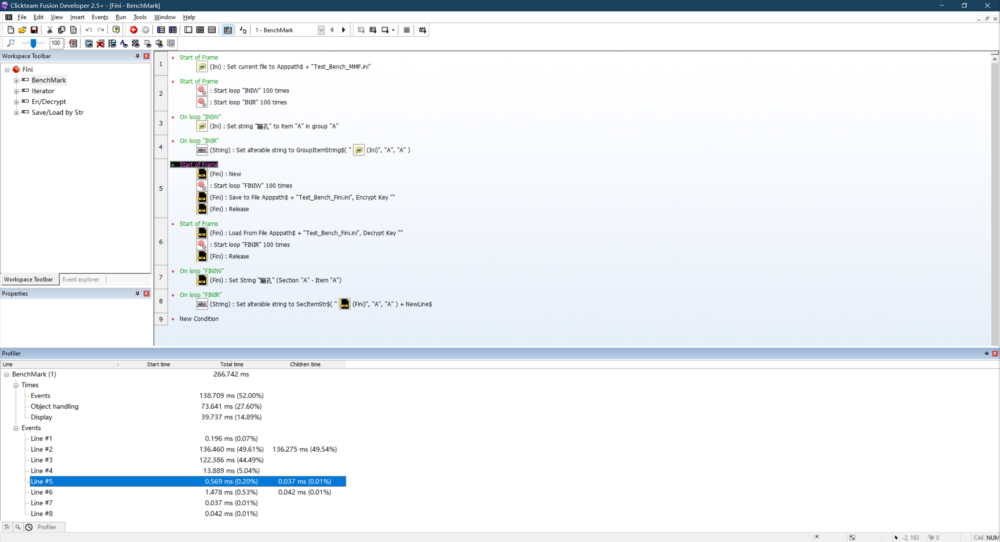

# Fini

## Description

Fini, based on brofield's brilliant work simpleini, is a faster ini ext for fusion.

about 200X faster when writing and 10X faster when reading, but you need to **load/save file manually**.

## Properties

This object has no properties

## Action

- Auto Save
  - *auto save file when object is destroyed, e.g. jump to another frame, or load from new file/string. use release to reset object before loading to avoid auto save*
  - *if filename or key is nullptr(default), file will not be saved*
  - *if file is not modified (e.g. set value), file will not be saved*
  - *Note: if you run your mfa in fusion, when changing frames, destroy routine may not be called. Don't worry, according to my rigorous test and precise calculation, everything works properly in stand-along*
  
  - Set On
    - *update auto filename and key here*
    - *if you open another file by `Load From File`, auto filename and key will be overwrited*
  - Set Off
    - *disable auto save*

- New
  - *you need this action to initialize.*
- Release
  - *release the data in memory.*

- Load From File
  - *if you load from file, extension will auto initialize itself.*
  - *if the file is not encrypted, keep the key section empty.*
- Load From String
  - *load from string, e.g.`[Sec]/r/nItem=Value`*

- Save to File
  - *if you don't want to encrypt the file, keep the key section empty.*

- Set Value (Section - Item)
  - *extension will auto initialize itself.*
  - *ext will take `1.00000` as integer*
  - *Note: you can only set values in a section, doesn't support item-only file like MMF.*
- Set String (Section - Item)
  - *extension will auto initialize itself.*
  - *Note: you can only set values in a section, doesn't support item-only file like MMF.*

- Copy Section
  - *Copy all items under SectionA to SectionB*

- Delete (Section - Item)
  - *Keep Item empty to delete the entire section.*
  - *Note: if a scetion is empty after you delete a item, this section will be deleted automatically*

- Iterate
  - Iterate Sections
  - Iterate Items
    - *need section name to start iterate.*
    - *if you start loop, "Currenct Section" will be set to the section name you inputted*

## Condition

- Iterate
  - On Iterate Sections
  - On Iterate Items

## Expression

- Get Value (Section - Item)
  - *if the value is float type(e.g. `114.514`), this expression will return float, otherwise ext return integer(e.g. `1919810`)*
  - *ext will take `1.00000` as integer*
  - *support float, e.g. -15.2, +13.7, 114.514, if the value is not a number, return 0*
  - *return 0 if there is no item match, or ext is not initialized.*
  - *Note: you can only read values in a section, doesn't support item-only file like MMF.*
- Get String (Section - Item)
  - *return "" if there is no item match.*
  - *Note: you can only read values in a section, doesn't support item-only file like MMF.*

- Get Current Section
  - *get the section name while iterating.*
- Get Current Item
  - *get the item name while iterating.*

- Save to String
  - *save the entire file to string.*
