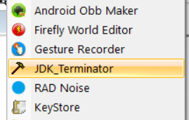

# JDK Terminator

## Why

Fusion will use JDK to build Android applications, but unfortunately, sometimes JDK process will not terminate correctly even you quit fusion. If you are using steam version, steam will think fusion is still running and refuse to restart fusion or steam itself, unless you terminate the process manually in task manager, which is annoying. This script can help you terminate it with a single click.

## How

~~Set `$JDKPath` in `JDK_Terminator.ps1` to JDK path, exactly the same as you set in fusion. (Tools->Preference->General->Exporters->Pathname of the JDK directory)~~

~~e.g., JDK path is `C:\AndroidStudio\jre`, then you should set `$JDKPath` in the first line of script to it.~~

Nothing, just run the exe, it will readFfusion config to find the JDK path.

Put it into Fusion's tools bar is recommended.

Compiled by [PS2EXE](https://github.com/MScholtes/PS2EXE)
